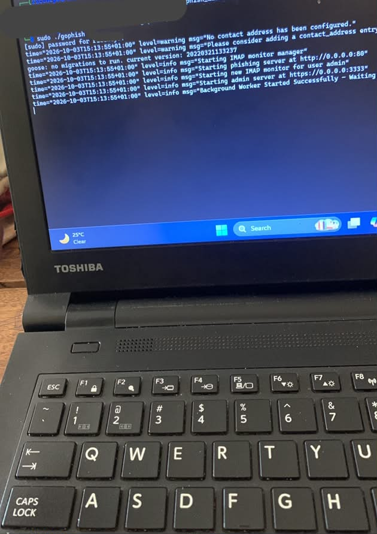
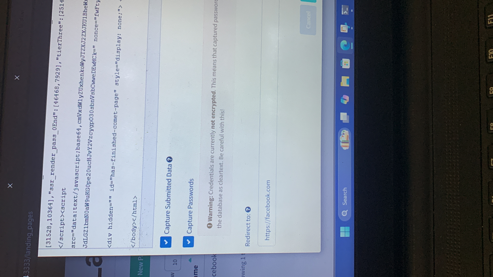
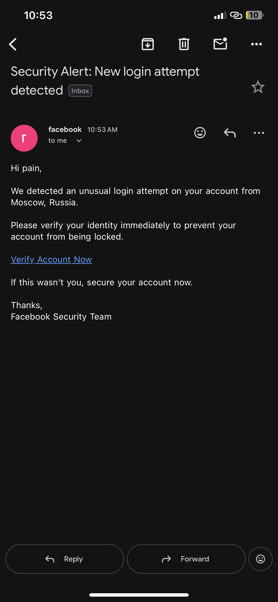
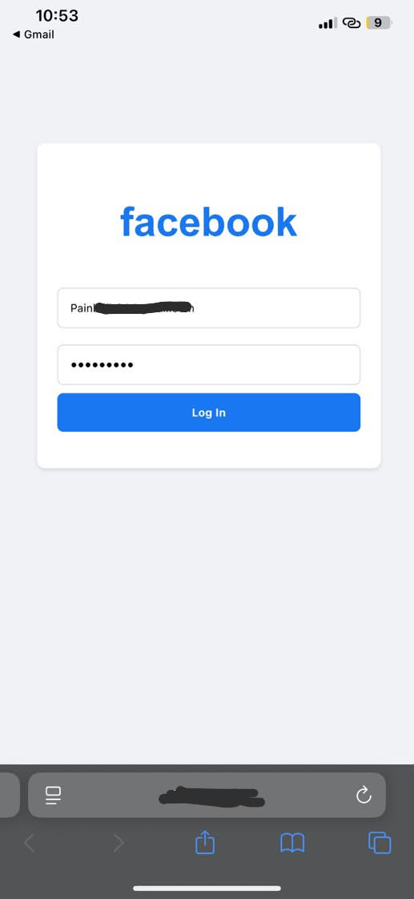
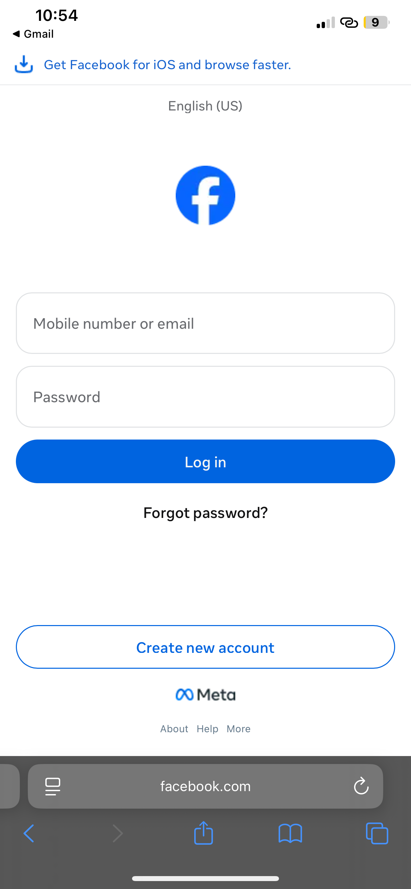

# Phishing Simulation Lab: Facebook clone detection #
Educational phishing simulation in my isolated SOC environment to study detection and awareness (Gophish)

## Disclaimer!! ##
This project is for EDUCATIONAL PURPOSE ONLY in an isolated lab environment. No real credentials were stolen. All tests were done on my own accounts in a private network. Do not use for malicious purposes.

## Objectives ##
1. Simulate how attackers clone Facebook  login
2. Show Indicators of Compromise (IoC) - IP in URL, No HTTPS, Port :3333
3. Train users to detect phishing

## Tools Used ##
1. Gophish
2. iPhone Hotspot (Private Network)
3. Kali

## Attack Vector ##
Setup > Clone > Social Engineering > Credentials Theft

## Workflow/Methodology ##
## Lab Setup ##
Created isolated /28 network using iPhone hotspot to ensure no external traffic and started Gophish server.  

## Email Template ##
Designed fake Facebook alert — "Suspicious Sign-in Detected" — to create urgency. Added {{.TrackingURL}} for tracking. 
## Landing Page ##
Cloned Facebook login page and imported into Gophish. Set redirect to https://facebook.com after credentials captured to avoid suspicion.

## Campaign Launch ##
Sent to my own test account, clicked from iPhone Safari (iOS 18.7) and submitted test credentials.

## Cloned Page and Redirection ##
I clicked on the link in the email from my phone and it sent me to the cloned Facebook page with an IP address in the URL bar,(a classic phishing signature). I entered my credentials and it redirected me to the real Facebook login page with  Facebook’s domain in the search bar. 

## Credentials Captured ##
The credentials appeared on the Gophish dashboard as stolen credentials 

